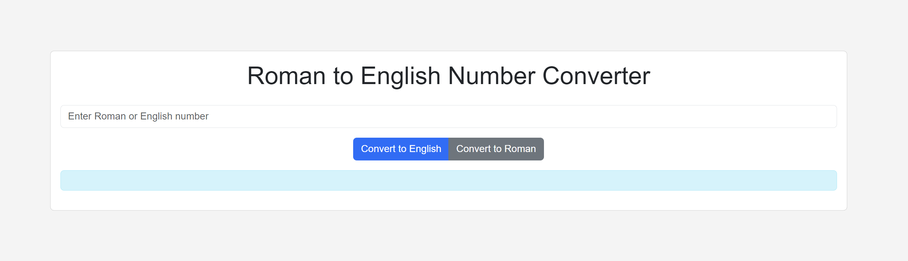

# Preview


# English-Roman Number Conversion Project
This project is designed to convert numbers between English and Roman numeral formats seamlessly.

## Technologies Used
This project is built with:
- 
- 
- 

## Features
- Convert numbers from English to Roman and vice versa
- User-friendly interface for easy conversions
- Responsive design for optimal viewing on various devices

## Installation
Steps to install and run the project.

```bash
# Clone the repository
git clone https://github.com/username/repository.git

# Navigate to the project folder
cd repository

# Open the project in a browser
open index.html
